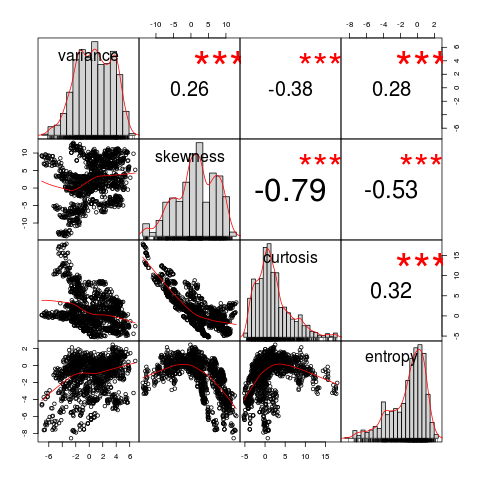

# Data Mining with R
## Table of Contents
* **[Data Overview](#data-overview)**
* **[Summary Statistics](#summary-statistics)**
  * **[Mean](#mean)**
  * **[Median](#median)**
  * **[All-in-One](#all-in-one)**
  * **[Correlation](#correlation)**
* **[Graphics](#graphics)**
  * **[Histograms](#histograms)**
  * **[Boxplots](#boxplots)**
* **[Near Zero Variance Predictors](#near-zero-variance-predictors)**
* **[Linear Combinations](#linear-combinations)**
* **[Highly Correlated Variables](#highly-correlated-variables)**
* **[Distribution](#distribution)**
* **[Decision Tree](#decision-tree)**
* **[Classification](#classification)**
  * **[SVM](#svm)**
  * **[KNN](#knn)**
  * **[SVM vs KNN](#svm-vs-knn)**

Import libs:
```R
library(caret)
library(data.table)
library(dplyr)
library(PerformanceAnalytics)
library(rpart.plot)
```

## Data Overview
Data Set Characteristics: | Number of Instances: | Attribute Characteristics: |  Number of Attributes: | Associated Tasks:
--- | --- | --- | --- | ---
Multivariate | 1372| Real | 5| Classification

**Dataset information:** Data were extracted from images that were taken from genuine and forged banknote-like specimens. For digitization, an industrial camera usually used for print inspection was used. The final images have 400 x 400 pixels. Due to the object lens and distance to the investigated object gray-scale pictures with a resolution of about 660 dpi were gained. Wavelet Transform tool were used to extract features from images.

**Attribute information:**
1. variance of Wavelet Transformed image (type: continuous) 
2. skewness of Wavelet Transformed image (type: continuous) 
3. curtosis of Wavelet Transformed image (type: continuous) 
4. entropy of image (type: continuous) 
5. class (type: integer)

**Data source:** https://archive.ics.uci.edu/ml/datasets/banknote+authentication

Load `data_banknote_authentication.txt` file:
```R
url = paste('https://archive.ics.uci.edu/ml/machine-learning-databases/00267/',
            'data_banknote_authentication.txt', sep='')
df = data.frame(fread(url))
names(df) = c('variance', 'skewness', 'curtosis', 'entropy', 'class')
```

Check size of dataframe:
```R
nrow(df)
```

**Output**:
```
1372
```

Show the first part of `df` dataframe:
```R
head(df, 5)
```

<table>
<thead><tr><th scope=col>variance</th><th scope=col>skewness</th><th scope=col>curtosis</th><th scope=col>entropy</th><th scope=col>class</th></tr></thead>
<tbody>
	<tr><td>3.62160 </td><td> 8.6661 </td><td>-2.8073 </td><td>-0.44699</td><td>0       </td></tr>
	<tr><td>4.54590 </td><td> 8.1674 </td><td>-2.4586 </td><td>-1.46210</td><td>0       </td></tr>
	<tr><td>3.86600 </td><td>-2.6383 </td><td> 1.9242 </td><td> 0.10645</td><td>0       </td></tr>
	<tr><td>3.45660 </td><td> 9.5228 </td><td>-4.0112 </td><td>-3.59440</td><td>0       </td></tr>
	<tr><td>0.32924 </td><td>-4.4552 </td><td> 4.5718 </td><td>-0.98880</td><td>0       </td></tr>
</tbody>
</table>

Show the last part of `df` dataframe:
```R
tail(df, 5)
```

<table>
<thead><tr><th></th><th scope=col>variance</th><th scope=col>skewness</th><th scope=col>curtosis</th><th scope=col>entropy</th><th scope=col>class</th></tr></thead>
<tbody>
	<tr><th scope=row>1368</th><td> 0.40614 </td><td>  1.34920</td><td>-1.4501  </td><td>-0.55949 </td><td>1        </td></tr>
	<tr><th scope=row>1369</th><td>-1.38870 </td><td> -4.87730</td><td> 6.4774  </td><td> 0.34179 </td><td>1        </td></tr>
	<tr><th scope=row>1370</th><td>-3.75030 </td><td>-13.45860</td><td>17.5932  </td><td>-2.77710 </td><td>1        </td></tr>
	<tr><th scope=row>1371</th><td>-3.56370 </td><td> -8.38270</td><td>12.3930  </td><td>-1.28230 </td><td>1        </td></tr>
	<tr><th scope=row>1372</th><td>-2.54190 </td><td> -0.65804</td><td> 2.6842  </td><td> 1.19520 </td><td>1        </td></tr>
</tbody>
</table>

## Summary Statistics
### Mean
```R
print(noquote(paste0('Mean. Variance of Wavelet Transformed image: ', mean(df$variance))))
print(noquote(paste0('Mean. Skewness of Wavelet Transformed image: ', mean(df$skewness))))
print(noquote(paste0('Mean. Curtosis of Wavelet Transformed image: ', mean(df$curtosis))))
print(noquote(paste0('Mean. Entropy of image: ', mean(df$entropy))))
```

**Output**:
```
[1] Mean. Variance of Wavelet Transformed image: 0.433735257069971
[1] Mean. Skewness of Wavelet Transformed image: 1.92235312063936
[1] Mean. Curtosis of Wavelet Transformed image: 1.39762711726676
[1] Mean. Entropy of image: -1.19165652004373
```

### Median
```R
print(noquote(paste0('Median. Variance of Wavelet Transformed image: ',
                     median(df$variance))))
print(noquote(paste0('Median. Skewness of Wavelet Transformed image: ',
                     median(df$skewness))))
print(noquote(paste0('Median. Curtosis of Wavelet Transformed image: ',
                     median(df$curtosis))))
print(noquote(paste0('Median. Entropy of image: ', median(df$entropy))))
```

**Output**:
```
[1] Median. Variance of Wavelet Transformed image: 0.49618
[1] Median. Skewness of Wavelet Transformed image: 2.31965
[1] Median. Curtosis of Wavelet Transformed image: 0.61663
[1] Median. Entropy of image: -0.58665
```

### All-in-One
```R
print(noquote('Summary:'))
summary(select(df, -class))
```

**Output**:
```
[1] Summary:

   variance          skewness          curtosis          entropy
Min.   :-7.0421   Min.   :-13.773   Min.   :-5.2861   Min.   :-8.5482
1st Qu.:-1.7730   1st Qu.: -1.708   1st Qu.:-1.5750   1st Qu.:-2.4135
Median : 0.4962   Median :  2.320   Median : 0.6166   Median :-0.5867
Mean   : 0.4337   Mean   :  1.922   Mean   : 1.3976   Mean   :-1.1917
3rd Qu.: 2.8215   3rd Qu.:  6.815   3rd Qu.: 3.1793   3rd Qu.: 0.3948
Max.   : 6.8248   Max.   : 12.952   Max.   :17.9274   Max.   : 2.4495
```

### Correlation
```R
cor(df)
```

<table>
<thead><tr><th></th><th scope=col>variance</th><th scope=col>skewness</th><th scope=col>curtosis</th><th scope=col>entropy</th><th scope=col>class</th></tr></thead>
<tbody>
	<tr><th scope=row>variance</th><td> 1.0000000 </td><td> 0.2640255 </td><td>-0.3808500 </td><td> 0.27681670</td><td>-0.72484314</td></tr>
	<tr><th scope=row>skewness</th><td> 0.2640255 </td><td> 1.0000000 </td><td>-0.7868952 </td><td>-0.52632084</td><td>-0.44468776</td></tr>
	<tr><th scope=row>curtosis</th><td>-0.3808500 </td><td>-0.7868952 </td><td> 1.0000000 </td><td> 0.31884089</td><td> 0.15588324</td></tr>
	<tr><th scope=row>entropy</th><td> 0.2768167 </td><td>-0.5263208 </td><td> 0.3188409 </td><td> 1.00000000</td><td>-0.02342368</td></tr>
	<tr><th scope=row>class</th><td>-0.7248431 </td><td>-0.4446878 </td><td> 0.1558832 </td><td>-0.02342368</td><td> 1.00000000</td></tr>
</tbody>
</table>

```R
chart.Correlation(select(df, -class), histogram=TRUE)
```



## Graphics
### Histograms
```R
par(mfrow=c(2,2))
hist(df$variance, main='Histogram of Variance',
     xlab='Variance of Wavelet Transformed Image')
hist(df$skewness, main='Histogram of Skewness',
     xlab='Skewness of Wavelet Transformed Image')
hist(df$curtosis, main='Histogram of Curtosis',
     xlab='Curtosis of Wavelet Transformed Image')
hist(df$entropy, main='Histogram of Entropy',
     xlab='Entropy of Image')
```


### Boxplots
```R
par(mfrow=c(2,2))
boxplot(df$variance, data = df, main='Boxplot. Variance', horizontal=TRUE)
boxplot(df$skewness, data = df, main='Boxplot. Skewness', horizontal=TRUE)
boxplot(df$curtosis, data = df, main='Boxplot. Curtosis', horizontal=TRUE)
boxplot(df$entropy, data = df, main='Boxplot. Entropy', horizontal=TRUE)
```


## Near Zero Variance Predictors
```R
nearZeroVar(select(df, -class), saveMetrics=TRUE)
```

<table>
<thead><tr><th></th><th scope=col>freqRatio</th><th scope=col>percentUnique</th><th scope=col>zeroVar</th><th scope=col>nzv</th></tr></thead>
<tbody>
	<tr><th scope=row>variance</th><td>1.25    </td><td>97.52187</td><td>FALSE   </td><td>FALSE   </td></tr>
	<tr><th scope=row>skewness</th><td>1.20    </td><td>91.54519</td><td>FALSE   </td><td>FALSE   </td></tr>
	<tr><th scope=row>curtosis</th><td>1.00    </td><td>92.56560</td><td>FALSE   </td><td>FALSE   </td></tr>
	<tr><th scope=row>entropy</th><td>1.00    </td><td>84.25656</td><td>FALSE   </td><td>FALSE   </td></tr>
</tbody>
</table>

## Linear Combinations
```R
findLinearCombos(select(df, -class))
```

<dl>
	<dt>$linearCombos</dt>
		<dd><ol>
</ol>
</dd>
	<dt>$remove</dt>
		<dd>NULL</dd>
</dl>

## Highly Correlated Variables
```R
df$class = as.character(ifelse(df$class=='1', 'Y', 'N'))
df2 = select(df, -class)
cor_matrix = cor(df2)
print(noquote('Highly correlated variables:'))
summary(cor_matrix[upper.tri(cor_matrix)]) # upper triangular part of a matrix
```

**Output**:
```
[1] Highly correlated variables:

    Min.  1st Qu.   Median     Mean  3rd Qu.     Max.
-0.78690 -0.48995 -0.05841 -0.13906  0.27362  0.31884
```

```R
high_cor_var = findCorrelation(cor_matrix, cutoff = 0.75) # check var above 0.75
print(noquote(paste0('Highly correlated variables: ', names(df2)[high_cor_var])))
```

**Output**:
```
[1] Highly correlated variables: skewness
```

Delete highly correlated `skewness` column from dataframe:
```R
df2 = select(df2, -skewness)
```

```R
cor_matrix = cor(df2)
print(noquote('Highly correlated variables:'))
summary(cor_matrix[upper.tri(cor_matrix)]) # upper triangular part of a matrix
df = cbind.data.frame(df2, class = df$class) # add class
```

**Output**:
```
[1] Highly correlated variables:

    Min.  1st Qu.   Median     Mean  3rd Qu.     Max.
-0.38085 -0.05202  0.27682  0.07160  0.29783  0.31884
```

## Distribution
```R
print(noquote('Distribution:'))
table(df$class)
```

**Output**:
```
[1] Distribution:

  N   Y
762 610
```

```R
class_freq = data.frame(table(df$class))
names(class_freq) = c('class', 'freq')
percent_chart = cbind(class_freq,
                      percent=round((class_freq$freq/sum(class_freq$freq))*100, 1))
percent_chart
```

<table>
<thead><tr><th scope=col>class</th><th scope=col>freq</th><th scope=col>percent</th></tr></thead>
<tbody>
	<tr><td>N   </td><td>762 </td><td>55.5</td></tr>
	<tr><td>Y   </td><td>610 </td><td>44.5</td></tr>
</tbody>
</table>

```R
slices = percent_chart$percent
lbls = c('N', 'Y')
pct = round(slices/sum(slices)*100, 1)
lbls = paste(lbls, pct) # add values of pct to labels
lbls = paste(lbls,"%",sep='') # add % char to labels
pie(slices, labels=lbls, radius=1, main="Pie Chart of Distribution",
    clockwise=TRUE)
```


```R
png(filename='feature_plot.png')
featurePlot(x=select(df, -class), y=df$class, plot='box')
dev.off()
featurePlot(x=select(df, -class), y=df$class, plot='box')
```


## Decision Tree
```R
rtree_set = rpart(class ~ ., df)
prp(rtree_set)

```


## Classification


Split the data to train and test sets:
```R
train_ind = createDataPartition(df$class, p=0.7, list=FALSE) 
data_train = data.frame(df[train_ind, ])
data_test = data.frame(df[-train_ind, ])
print(noquote('Train:'))
table(data_train$class)
print(noquote('Test:'))
table(data_test$class)
```

**Output**:
```
[1] Train:

  N   Y
534 427

[1] Test:

  N   Y
228 183
```

Choose validation method for the test of model:
```R
valid_par = trainControl(method='repeatedcv', number=5, repeats=10, p=0.70, preProc='range') 
```

### SVM
```R
mod_svm = train(class ~ ., data=data_train, trControl=valid_par, method='svmRadial')
mod_svm
```

**Output**:
```
Support Vector Machines with Radial Basis Function Kernel 

961 samples
  3 predictors
  2 classes: 'N', 'Y' 

No pre-processing
Resampling: Cross-Validated (5 fold, repeated 10 times) 
Summary of sample sizes: 768, 769, 770, 769, 768, 770, ... 
Resampling results across tuning parameters:

  C     Accuracy   Kappa    
  0.25  0.9785620  0.9568214
  0.50  0.9807452  0.9612074
  1.00  0.9815764  0.9628818

Tuning parameter 'sigma' was held constant at a value of 0.8345372
Accuracy was used to select the optimal model using the largest value.
The final values used for the model were sigma = 0.8345372 and C = 1.
```

### KNN
```R
mod_knn = train(class ~. , data=data_train, trControl=valid_par, method="knn")
mod_knn
```

**Output**:
```
k-Nearest Neighbors

961 samples
  3 predictors
  2 classes: 'N', 'Y'

No pre-processing
Resampling: Cross-Validated (5 fold, repeated 10 times)
Summary of sample sizes: 768, 769, 769, 769, 769, 768, ...
Resampling results across tuning parameters:

  k  Accuracy   Kappa
  5  0.9761700  0.9519131
  7  0.9766871  0.9529962
  9  0.9748131  0.9492504

Accuracy was used to select the optimal model using the largest value.
The final value used for the model was k = 7.
```

Show summary:
```R
print(noquote('Summary:'))
mod_results = resamples(list(SVM=mod_svm, KNN=mod_knn))
summary(mod_results)
```

**Output**:
```
[1] Summary:

Call:
summary.resamples(object = mod_results)

Models: SVM, KNN
Number of resamples: 50

Accuracy
         Min.   1st Qu.    Median      Mean   3rd Qu.      Max. NA's
SVM 0.9633508 0.9740933 0.9843750 0.9815764 0.9882606 1.0000000    0
KNN 0.9581152 0.9687905 0.9740933 0.9766871 0.9843750 0.9947917    0

Kappa
         Min.   1st Qu.    Median      Mean   3rd Qu.      Max. NA's
SVM 0.9264050 0.9478632 0.9684487 0.9628818 0.9762997 1.0000000    0
KNN 0.9157941 0.9372235 0.9476255 0.9529962 0.9684487 0.9894575    0
```

### SVM vs KNN
```R
png(filename='svm_vs_knn.png')
bwplot(mod_results, scales=list(x=list(relation='free'), y=list(relation='free')))
dev.off()
bwplot(mod_results, scales=list(x=list(relation='free'), y=list(relation='free')))
```


Test models:
```R
test = select(data_test, -class)
test_sum = data_test$class 
mod_predict_svm = predict(mod_svm, test)
print(noquote('SMV:'))
confusionMatrix(mod_predict_svm, test_sum)
mod_predict_knn = predict(mod_knn, test)
print(noquote('KNN:'))
confusionMatrix(mod_predict_knn, test_sum)
```

**Output**:
```
[1] SMV:

Confusion Matrix and Statistics

          Reference
Prediction   N   Y
         N 222   1
         Y   6 182

               Accuracy : 0.983
                 95% CI : (0.9652, 0.9931)
    No Information Rate : 0.5547
    P-Value [Acc > NIR] : <2e-16

                  Kappa : 0.9656
 Mcnemar's Test P-Value : 0.1306

            Sensitivity : 0.9737
            Specificity : 0.9945
         Pos Pred Value : 0.9955
         Neg Pred Value : 0.9681
             Prevalence : 0.5547
         Detection Rate : 0.5401
   Detection Prevalence : 0.5426
      Balanced Accuracy : 0.9841

       'Positive' Class : N

    [1] KNN:

    Confusion Matrix and Statistics

          Reference
Prediction   N   Y
         N 223   2
         Y   5 181

               Accuracy : 0.983
                 95% CI : (0.9652, 0.9931)
    No Information Rate : 0.5547
    P-Value [Acc > NIR] : <2e-16
 
                  Kappa : 0.9656
 Mcnemar's Test P-Value : 0.4497

            Sensitivity : 0.9781
            Specificity : 0.9891
         Pos Pred Value : 0.9911
         Neg Pred Value : 0.9731
             Prevalence : 0.5547
         Detection Rate : 0.5426
   Detection Prevalence : 0.5474
      Balanced Accuracy : 0.9836

       'Positive' Class : N
```
