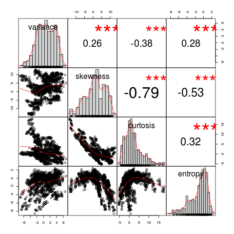
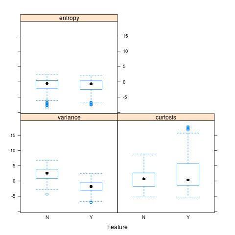
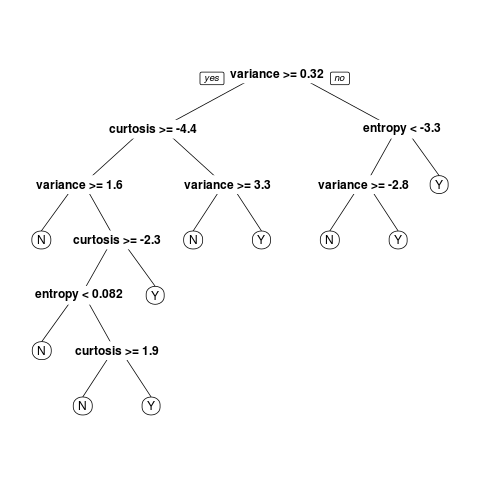
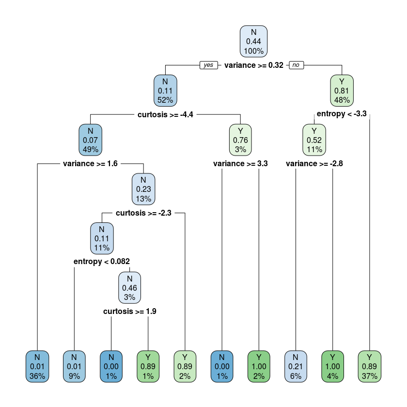

# Eksploracja Danych w R

## Spis treści
* **[Przegląd danych](#przegląd-danych)**
* **[Statystyki ogólne](#statystyki-ogólne)**
* **[Korelacja](#korelacja)**
* **[Wizualizacja atrybutów](#wizualizacja-atrybutów)**
* **[Wariacja](#wariacja)**
* **[Kombinacja liniowa](#kombinacja-liniowa)**
* **[Dystrybucja](#dystrybucja)**
* **[Drzewo decyzyjne](#drzewo-decyzyjne)**

## Przegląd danych
Charakterystyka: | Rozmiar: | Ilość atrybutów: | Charakterystyka atrybutów: | Powiązane zadania:
--- | --- | --- | --- | ---
wielowymiarowe | 5 x 1372 | 5 | liczby rzeczywiste | klasyfikacja (ang. classification)

Dane zostały wydobyte ze zdjęć oryginalnych i podrobionych banknotów. Do digitalizacji użyto kamery przemysłowej zwykle używanej do kontroli wydruku. Zdjęcia mają rozmiar 400 x 400 pikseli, są w skali szarości o rozdzielczości około 660 dpi. Narzędzie `Wavelet Transform` zostało użyte do wydobycia danych ze zdjęć.

**Źródło**: https://archive.ics.uci.edu/ml/datasets/banknote+authentication

**Atrybuty**:
1. wariancja (ang. variance),
2. współczynnik skośności (ang. skewness),
3. kurtoza (ang. curtosis),
4. entropia (ang. entropy),
5. klasa (ang. class).

Mamy dla analizy zbiór danych, który zawiera 5 kolumn oraz 1372 wierszy. Pierwsze cztery kolumny zawierają  dane wydobyte ze zdjęć. Ostatnia piąta kolumna wskazuje czy banknot są oryginalna. Gdzie `1` -- oryginał, `0` -- podróbka. Dane są liczby rzeczywistymi.

## Statystyki ogólne
Ładowanie pakietów:
```r
library(caret)
library(data.table)
library(dplyr)
library(PerformanceAnalytics)
library(rpart.plot)
```

Ładowanie zbioru danych:
```r
url = 'http://bit.ly/banknote-auth'
df = data.frame(fread(url))
names(df) = c('variance', 'skewness', 'curtosis', 'entropy', 'class')
```

Sprawdzimy strukturę danych:
```r
str(df)
```

**Wynik**:
```
'data.frame':	1372 obs. of  5 variables:
 $ variance: num  3.622 4.546 3.866 3.457 0.329 ...
 $ skewness: num  8.67 8.17 -2.64 9.52 -4.46 ...
 $ curtosis: num  -2.81 -2.46 1.92 -4.01 4.57 ...
 $ entropy : num  -0.447 -1.462 0.106 -3.594 -0.989 ...
 $ class   : int  0 0 0 0 0 0 0 0 0 0 ...
```

Wyświetlimy pierwsze pięć wierszy:
```r
head(df, 5)
```

<table>
<thead><tr><th scope=col>variance</th><th scope=col>skewness</th><th scope=col>curtosis</th><th scope=col>entropy</th><th scope=col>class</th></tr></thead>
<tbody>
	<tr><td>3.62160 </td><td> 8.6661 </td><td>-2.8073 </td><td>-0.44699</td><td>0       </td></tr>
	<tr><td>4.54590 </td><td> 8.1674 </td><td>-2.4586 </td><td>-1.46210</td><td>0       </td></tr>
	<tr><td>3.86600 </td><td>-2.6383 </td><td> 1.9242 </td><td> 0.10645</td><td>0       </td></tr>
	<tr><td>3.45660 </td><td> 9.5228 </td><td>-4.0112 </td><td>-3.59440</td><td>0       </td></tr>
	<tr><td>0.32924 </td><td>-4.4552 </td><td> 4.5718 </td><td>-0.98880</td><td>0       </td></tr>
</tbody>
</table>

Wyświetlimy statystyki podsumowujące (ang. summary statistics):
```r
summary(select(df, -class))
```

**Wynik**:
```
   variance          skewness          curtosis          entropy
Min.   :-7.0421   Min.   :-13.773   Min.   :-5.2861   Min.   :-8.5482
1st Qu.:-1.7730   1st Qu.: -1.708   1st Qu.:-1.5750   1st Qu.:-2.4135
Median : 0.4962   Median :  2.320   Median : 0.6166   Median :-0.5867
Mean   : 0.4337   Mean   :  1.922   Mean   : 1.3976   Mean   :-1.1917
3rd Qu.: 2.8215   3rd Qu.:  6.815   3rd Qu.: 3.1793   3rd Qu.: 0.3948
Max.   : 6.8248   Max.   : 12.952   Max.   :17.9274   Max.   : 2.4495
```

## Korelacja
Dla analizy skorzystamy z funkcji `cor()`:
```r
cor(df)
```

<table>
<thead><tr><th></th><th scope=col>variance</th><th scope=col>skewness</th><th scope=col>curtosis</th><th scope=col>entropy</th><th scope=col>class</th></tr></thead>
<tbody>
	<tr><th scope=row>variance</th><td> 1.0000000 </td><td> 0.2640255 </td><td>-0.3808500 </td><td> 0.27681670</td><td>-0.72484314</td></tr>
	<tr><th scope=row>skewness</th><td> 0.2640255 </td><td> 1.0000000 </td><td>-0.7868952 </td><td>-0.52632084</td><td>-0.44468776</td></tr>
	<tr><th scope=row>curtosis</th><td>-0.3808500 </td><td>-0.7868952 </td><td> 1.0000000 </td><td> 0.31884089</td><td> 0.15588324</td></tr>
	<tr><th scope=row>entropy</th><td> 0.2768167 </td><td>-0.5263208 </td><td> 0.3188409 </td><td> 1.00000000</td><td>-0.02342368</td></tr>
	<tr><th scope=row>class</th><td>-0.7248431 </td><td>-0.4446878 </td><td> 0.1558832 </td><td>-0.02342368</td><td> 1.00000000</td></tr>
</tbody>
</table>

Identyfikacji silnie skorelowanych zmiennych. Wyświetlimy wykres ze współczynnikiem korelacji dla atrybutów:
```r
chart.Correlation(select(df, -class), histogram=T)
```



Zrobimy podsumowanie poziomu współczynnika korelacji:
```r
df$class = ifelse(df$class=='1', 'Y', 'N')
df2 = select(df, -class)
cor_matrix = cor(df2)
summary(cor_matrix[upper.tri(cor_matrix)])
```

**Wynik**:
```
    Min.  1st Qu.   Median     Mean  3rd Qu.     Max.
-0.78690 -0.48995 -0.05841 -0.13906  0.27362  0.31884
```

Sprawdzimy atrybuty zmiennych ze współczynnikiem korelacji powyżej 0,75. Skorzystamy z funkcji `findCorrelation()`:
```r
names(df[findCorrelation(cor_matrix, cutoff = 0.75)])
```

**Wynik**:
```
'skewness'
```

Usuniemy kolumnę `skewness` i ponownie zrobimy podsumowanie poziomu współczynnika korelacji:
```
df2 = select(df2, -skewness)
cor_matrix = cor(df2)
summary(cor_matrix[upper.tri(cor_matrix)])
df = cbind.data.frame(df2, class = df$class) # dodamy `class`
```

**Wynik**:
```
    Min.  1st Qu.   Median     Mean  3rd Qu.     Max.
-0.38085 -0.05202  0.27682  0.07160  0.29783  0.31884
```

## Wizualizacja atrybutów
Skorzystamy z funkcji `featurePlot`:
```r
featurePlot(x=select(df, -class), y=df$class, plot='box')
```



## Wariacja
Sprawdzimy atrybuty z wariacją bliską zera. Skorzystamy z funkcji `nearZeroVar()`:
```r
nearZeroVar(select(df, -class), saveMetrics=T)
```

<table>
<thead><tr><th></th><th scope=col>freqRatio</th><th scope=col>percentUnique</th><th scope=col>zeroVar</th><th scope=col>nzv</th></tr></thead>
<tbody>
	<tr><th scope=row>variance</th><td>1.25    </td><td>97.52187</td><td>FALSE   </td><td>FALSE   </td></tr>
	<tr><th scope=row>skewness</th><td>1.20    </td><td>91.54519</td><td>FALSE   </td><td>FALSE   </td></tr>
	<tr><th scope=row>curtosis</th><td>1.00    </td><td>92.56560</td><td>FALSE   </td><td>FALSE   </td></tr>
	<tr><th scope=row>entropy</th><td>1.00    </td><td>84.25656</td><td>FALSE   </td><td>FALSE   </td></tr>
</tbody>
</table>

## Kombinacja liniowa
Sprawdzimy zaleznosci liniowe miedzy atrybutami:
```r
findLinearCombos(select(df, -class))
```

**Wynik**:
```
$linearCombos
list()

$remove
NULL
```

## Dystrybucja
Wyświetlimy dystrybucję:
```
df2 = data.frame(table(df$class))
names(df2) = c('class', 'freq')
cbind(df2, percent=round((df2$freq/sum(df2$freq))*100, 1))
```

<table>
<thead><tr><th scope=col>class</th><th scope=col>freq</th><th scope=col>percent</th></tr></thead>
<tbody>
	<tr><td>N   </td><td>762 </td><td>55.5</td></tr>
	<tr><td>Y   </td><td>610 </td><td>44.5</td></tr>
</tbody>
</table>

## Drzewo decyzyjne
Wyświtlimy drzewo decyzyjne:
```r
rtree_set = rpart(class ~., df)
prp(rtree_set)
```



Teraz wyświtlimy drzewo decyzyjne oraz szczegóły dodatkowe:
```r
rpart.plot(rtree_set)
```


